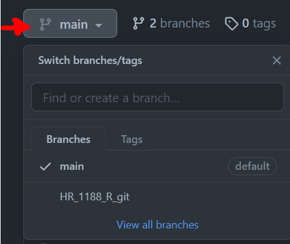
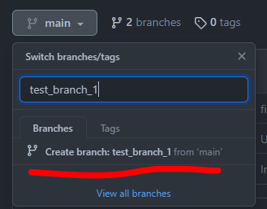
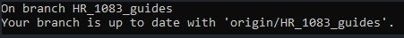
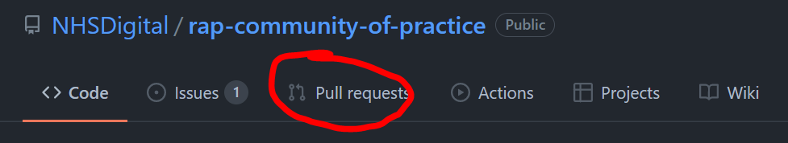

# Overview

> Feel free to use the table of contents attached to the top left of this guide for quicker navigation!

This page is intended as a starting point for R users who are new to using Git. It shows you the basic commands and the workflow to use Git on your own, in conjunction with using Codespaces.

To use Git as a team you should complete this section and the following section on [using git collaboratively](./using_git_collaboratively.md).

## What is version control?

Version control is the practice of tracking and managing any changes on project's code, scripts and/or project structure over time. This allows you to observe a detailed history of the changes made and enables your team members to collaborate on the same project.

## What is Git?

Git is a free open-source software used to apply version control in any file system, used in software development and data analysis projects. The [Git official distribution webpage](https://git-scm.com/book/en/v2/Getting-Started-What-is-Git%3F) contains a nice introduction and workflows covering more information on what is Git in detail.

In Git, each user has the entire repository (project's working directory) on their computer (offline), hence, they can work separately offline until they opt to push their updated version of the code to the remote (online) central repository.

Remote repositories are versions of your project that are hosted on an online Version Control System. In NHS Digital, we store that in GitLab, site for internal users. For the public we recommend to create an account on GitHub as the platform to share code online, either via a public or private repository.

## Why should I care?

Using version control is one of the fundamental skills needed by analysts to produce high-quality analytical outputs. Git is **the standard** for tracking code over time and is the way that NHS Digital (NHSD) has chosen. While Git has a steep initial learning curve, the payoff is huge and so we strongly recommend taking the time to learn this as a team.

The benefits of using version control include:

* Understanding what happened in the past. E.g., what did we change last time we ran this code
* Restoring previous versions
* Tracking changes - avoid accidentally breaking code
* The ability to work on the same project collaboratively
* The ability to review someone's changes and to leave comments
* The ability to plan development work more effectively through being able to assign small, discrete changes
* Avoid code being hidden away on someone's machine
* The ability to set up an approval process for changes
* The ability to make changes without breaking anything - through running automated tests
* The ability to try out experiments without the risk of breaking your main code

### Glossary of terms

Here's a list of commonly used Git terms, keep it on hand as it will help you understand the technical jargon mentioned in the next few sections:

* [Git terminology](https://www.javatpoint.com/git-terminology)

### Common basic commands

Below is a list of common commands for reference. We only list basic commands here. This is just to flag to you that these commands exist.

* Create a new Git repo locally: `git init`. The init command is short for "initialise", it's the command that will do all of the initial setup of a repository. The folder needs to actually exist before we can create a new repository with Git.

* Clone an existing Git Repository: `git clone <url>`. Happens only once, when you need to create a local copy of a Git repository.

* Check whether any files have changed in a repository: `git status`. It lists the files you've changed and those you still need to add or commit. It displays the state of the working directory and the staging area. It lets you see which changes have been staged, which haven't, and which files aren't being tracked by Git. Status output does not show you any information regarding the committed project history.

* Create and switch to a new branch: `git checkout -b <your branch name>`.

* Check out a branch: `git checkout <your branch name.`. Check out an existing new branch.

* Add file contents/stages changes from the working directory to the index: `git add <filename>` or `git add .`

* Commit staged files with a message: `git commit -m "<message>"`. Committing changes in this way captures a snapshot of the project's currently staged changes. Committed snapshots can be thought of as “safe” versions of a project

* Update your branch with the online/remote branch info: `git pull`. Pulls the latest changes from the repository, only affects the current active branch you’re in.

* Check the history of commits: `git log`.

* Show unstaged changes between your index and working directory: `git diff`. Press `Q` to exit the diff log.

* Ignore files: `.gitignore file`. This file specifies untracked files that Git should ignore such as the sensitive information related to security or the data itself. Files already tracked by Git are not affected.

* Display a list of all branches in the repository: `git branch -a`.

* Delete a local branch: `git branch -D <your branch name>`.

### Git commands cheat sheet

* [Git commands cheatsheet](https://training.github.com/downloads/github-git-cheat-sheet/)

### Undoing changes via Git commands

GitLab has a guide covering various cases on undoing any changes: <https://docs.gitlab.com/ee/topics/git/numerous_undo_possibilities_in_git/>

## Git started: Setup for Git Basics exercise

We are using GitHub as our Git repository hosting platform:

### Create a GitHub account

Visit this [link](https://github.com/join) to create a GitHub account, it's free!

## Steps 1 - 5: Accessing a Git repository via Codespaces, creating a branch, adding a new file, uploading your changes to GitHub (via GitHub Codespaces)
This language agnostic exercise covers the basics of accessing a Git repository, creating a new branch, making changes to your branch and then finally commiting and pushing these changes back to the repository on GitHub. Depending on your starting point, the initial steps might differ (i.e. might have to download Git if using local machine) however steps 1-5 cover the core applicability of Git which is the same, despite your starting point (i.e. Posit Cloud/local machine Git/Codespaces users etc.)

* To use Git via RStudio please view the links below.
* To use Git on your local machine please via the third link below, `Using Git locally`.

> **For RStudio/Posit users**
> 1. Using [RStudio Desktop](https://github.com/nhs-r-community/git_training/blob/2022-workshop-materials-rstudio/guides/introduction_to_git.md#using-rstudio-desktop)
> 2. Using [RStudio Cloud](https://github.com/nhs-r-community/git_training/blob/2022-workshop-materials-rstudio/guides/introduction_to_git.md#using-rstudio-cloud)

> **Using Git locally**
> 1. Follow this [link](https://github.com/nhs-r-community/git_training/blob/2022-workshop-materials-rstudio/guides/introduction_to_git.md#1-creating-your-local-git-repository-folder) for steps how to use Git locally.

#### Step 1. Start a Codespaces session

GitHub has excellent resources on had to initialise Codespaces sessions, see [Creating a codespace for a repository](https://docs.github.com/en/codespaces/developing-in-codespaces/creating-a-codespace-for-a-repository#creating-a-codespace-for-a-repository).

* Type ```git status``` in the terminal, usually the lower panel. You should see the this message:


#### 2. Create and switch to a new branch

**"Branch"** is another word for "version". Usually when developing a document or slides for a presentation, we could have numerous versions of the same slides, with small or major differences. By using different branches (or versions) of the same code, we can safely work and test without breaking the publication code, that resides in the default main branch of the repository.

Notice how in the image above, the first line says `On branch main`. In Git, `main` is a naming convention for a branch. This means that `main` can be seen as a repository's `default` branch. 

> It is considered best practice to lock the default `main` branch, to protect the main build of your working code and/or documentation, see [here](https://docs.github.com/en/repositories/configuring-branches-and-merges-in-your-repository/managing-protected-branches/managing-a-branch-protection-rule) on how to lock the main branch.

To add new code/documentation/make any edits to the main branch, you need to submit a [pull request](introduction_to_git.md#how-to-submit-a-pull-request). We will visit this step later in the exercise.

* To create a **new branch**, head over to GitHub, on the repository's main page, same webpage we used to find the Git clone repository's URL. To create a new branch on GitHub simply click on the "main" button underneath your repository's title.



* Once in the dropdown menu, type in the branch's new name and hit Enter. You should now have a new branch, copy of the main branch.



* In the above image notice how it points the original branch we are copying from, in grey letters: from `main`. If you wish to create a new branch, which will be a copy from a different branch to `main`, then set the repository to the branch you wish to copy from and then repeat the previous steps.

* Back to the terminal (e.g. Command Prompt/Anaconda Prompt/Git Bash etc.), type `git branch -a` to view a list of all available branches existing in the repository. The branches that contain the `remote/` path are the branches online, on GitHub.

Have a look at the list. You will notice your new branch is not there yet. To update your local master branch with all the lastest updates on Gitlab, type ```git pull```. Then, type `git branch -a` and you should see your branch available in the list now.

* To start working on your branch and select, type in the terminal `git checkout <your branch name>`.

* Type ```git status``` and this way you can confirm that you are in a new branch. Git will display a message showing the current branch name and the current branch's information.



_**Reminder:** any changes you make while in the main branch won't be uploaded to GitHub, as the main branch is protected and locked, so make sure you are in your own working branch! You can confirm this by typing `git status` in the terminal like above._

##### Branch naming strategy

Following an agreed naming convention will make it much easier to keep the team's work organised. We follow this approach:

`<initials>_<brief-description>`

Here the project_id refers to our project ID in confluence (DS218). The initials are from my name. The ticket number refers to the jira ticket number.
E.g.:

`CQ_Add-field-definitions`

Naming branches in this way helps to make it very clear what change should be happening in the branch. Sometimes code review will reveal that a branch that was intended to make one specific change in fact makes several changes. This should be avoided and the code review should reject the additional changes.

#### 3. Add a new file, make a few changes**

There are several ways to add a new file to the repository.

* For this exercise, we will create a file, with simply right-clicking on the designated folder on the left side panel `Explorer` and then selecting the `New File` option. Feel free to name the file however you wish and add any content.

#### 4. Commit your changes (follow standard Git command workflow)

In terminal, type the following. I suggest to read through the git messages displayed after each command entered in the terminal, to familiarise yourself with the logic.

i. Type ```git status``` to see the modifications that haven't been staged yet (in red colour).

ii. Type ```git add <filename>``` to stage your changes. Or ```git add .``` to simply stage all changes automatically (use with caution).

iii. Type ```git status``` to see the file modifications now have a green colour. This means that Git add was succesfull.

iv. Type ```git commit -m "your commit message here"``` to commit these changes.

v. Type ```git status``` to view the status of your repo. There should be no modifications visible (or colours!).

vi. Type ```git push```. This command will upload all your commited changes to GitHub.

#### 5. Check the repository on GitHub to view the changes updated

Simply head over the repository page on GitHub, select your branch and compare the changes between your branch and the master branch.

## How to: Submit a pull request

**Pull request (PR)** is the application you submit on the GitHub repository, to announce to other collaborators working on the repository that you have a new change ready to be merged/part of the main build, the main branch of the repository. Then, either your collaborators or someone you assign will review the change and the branch you have been working on to determine whether the change is ready to be merged with the main branch. The equivalent term for GitLab users is Merge Request (MR).

To submit a pull request:

1. Navigate to your repository on GitHub

2. Select Pull requests on the top bar menu.

3. Either select New Pull Request (big green button) on the right hand side or select Compare & pull request if you recently pushed new changes to the branch.

4. Base ref will default to the main branch, head ref will be the branch you wish to merge with the main branch. You can change any of these options, there will be occasions you won't always aim to merge every branch to the main branch.

5. Click Create Pull Request.

6. Give the Pull Request a title that summarises the changes you are proposing in a few words. Add any more detail that might help reviewers understand your changes in the 'description' section. On the right hand side you can assign yourself as the Assignee, and assign someone in your team to be the Reviewer. Then, select Create Pull Request.

## How to: Accept a pull request

If you are assigned as the reviewer of a pull request, you should receive an email notification from GitHub with a link to the pull request's webpage. You can also view any active pull requests by clicking on pull requests on the top bar menu.

 > For more info on Code Reviews and why they matter, visit [here](https://github.com/NHSDigital/rap-community-of-practice/blob/main/docs/implementing_RAP/code-review.md).



On the Pull request page, there are four tabs: Conversation, Commits, Checks and Files changed:

### Conversation

**Conversation** is the main pull request page. It contains the pull request's description, timeline and comments left by the assignee or reviewer. To merge a pull request you have 3 presented options:

* Merge pull request: this will keep all commits history of the source branch and will be added to the target branch. Creates a symbolic commit.
* Squash and merge: ticking this will merge the history of commits for the source branch into one commit. This can be useful when the pull request is not a major update and you don't want your repository's history of commits to contain commits with messages such as "fixed typo", "replaced incorrectly placed image". Creates a merged commit.
* Rebase and merge: adds all source branch commits in front of the target branch's commits. Does not create a symbolic commit.

### Commits

**Commits** tab displays a history of the pull request's commits. So for example, if the reviewer decides that minor adjustments are required and the assignee pushes these changes to Gitlab, then these commits will be captured in this tab.

### Files changes

**Files changed** tab, here you can see all the new changes in the pull request's source branch. You can also opt for a side-by-side comparison, and see line-by-line how the master version and new branch version compare. You can also leave comments on each file's line, which will also be recorded in the Conversation tab's timeline.

### Checks

**Checks** is part of the GitHub Actions functionality, which enchances your code review processes with apps and automated reviewing checks. This is inactive on default.

If you are happy to merge the two branches, then select the type of pull request you wish to apply and the pull request should be completed in a few seconds.

## How to: Update your local main branch to the latest remote main version on GitHub/GitLab

### Why is this useful?

Before submitting a merge request, your branch is required to be up to date with contents from the main branch. If you try to merge your branch with the main branch without doing so, Git/GitHub will potentially trigger a merge conflict warning, that your branch is not up to date with main and potentially outdated versions on your  branch will collide with newer versions on main.

### How to do it?

1. Open a command terminal. This can be accessed by typing, for example Anaconda Prompt, in the search bar, after opening the search icon on your Windows toolbar.

2. Type ```cd <paste your work directory address>``` in the terminal to switch to your working directory. This is where the Git repository is cloned/copied/downloaded to, on your local machine (or RDS environment or any environment you're using). This will cause the default terminal address to be directed at the new directory. (see [Git Clone instructions above](introduction_to_git.md#2-git-clone-copy-a-github-repository)  for more info)

3. Type ```git status``` in the terminal to ensure that ```ii``` happened successfully and you are on the default main branch. You should see this message:


4. Type ```git pull``` to update your local main branch with the latest version of the remote/online GitHub main branch. This might take a few seconds.

(Optional) 5. If you're in a different branch and not the main branch, then type in the terminal ```git checkout main``` and then ```git status``` to confirm you are on the main branch.

## What is: the .gitignore file

.gitignore is a text file that contains file extensions and directories' paths that we wish Git to ignore. For example, we have created a repository on GitHub that should never contain any sensitive data. To ensure this, in the repository's .gitignore file we will include ```.csv```, `.xlsx` or any other file format that can contain data.

GitHub has a .gitignore [template](https://github.com/github/gitignore/blob/main/R.gitignore) available to analysts and developers to use in their projects. Notice how in the template, line 22 contain RStudio project settings, which are configuration files created by RStudio when you first open your repository as an RStudio project. Sometimes these configuration files can contain information you don't want to publish on GitHub/GitLab, thus by including them in the .gitignore file you are ensuring that these files will never leave your local machine.

## What is: the README.md file

This will show up on GitHub when we push the code, written in Markdown (hence the .md extension).

> Markdown is a "markup language", which is basically just a way to write plain text that end up getting formatted nicely. It is used on GitHub and GitLab, and can also be used in an interactive python notebook cell.

On the first line of your README.md file,  write the title. Use a # (hash) key followed by a space before the title of your project. The number of hashes sets the header level, with one hash being the title. Other headings in your README should be at least two hashes.

On the second line, put a short, one-line description of the project.

# External links

* [GitHub Docs - Pull requests](https://docs.github.com/en/pull-requests)
